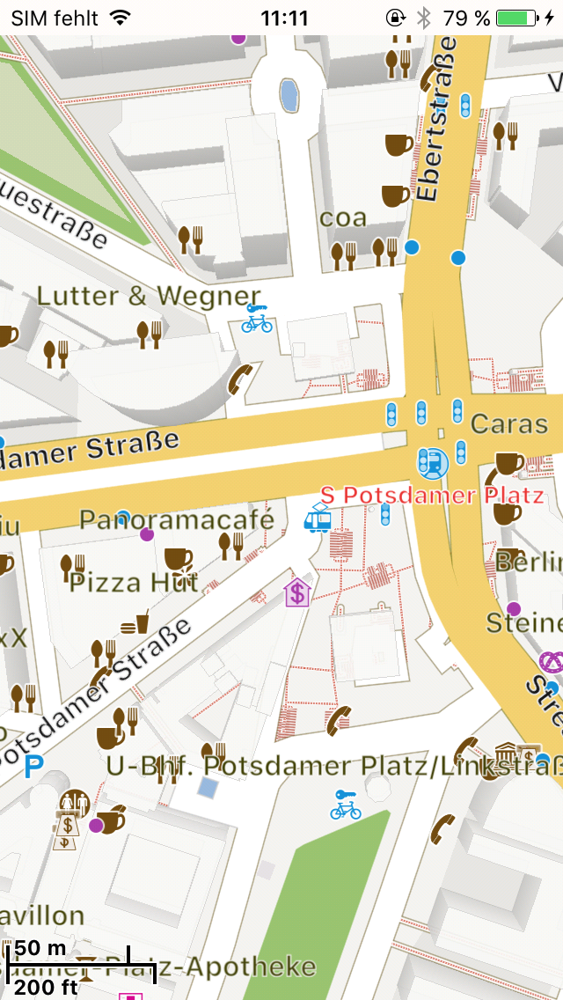
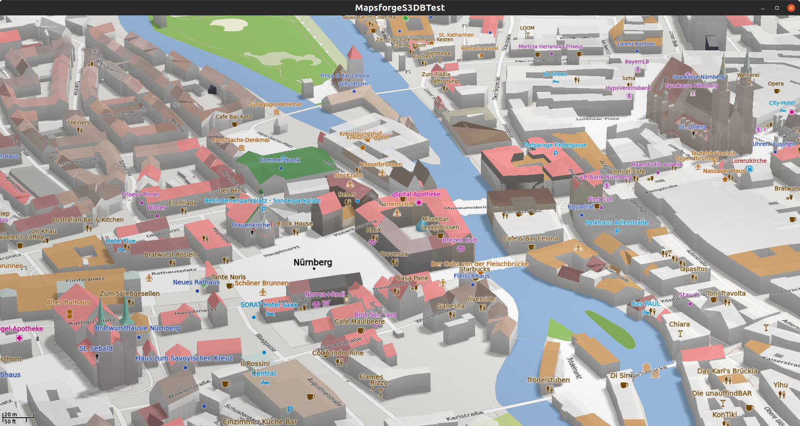
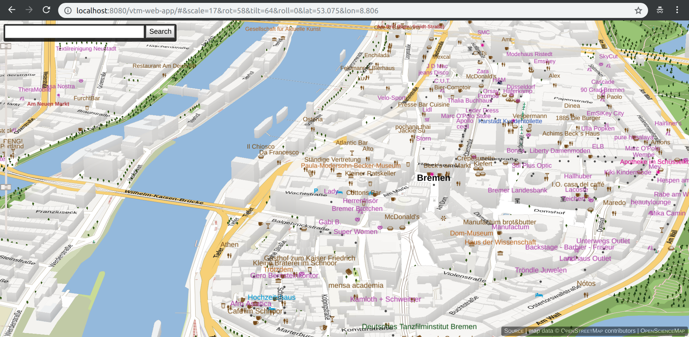

# V™

VTM was developed within the [OpenScienceMap](https://github.com/opensciencemap) project.

**This fork continues VTM development. And provides compatibility with latest [Mapsforge](https://github.com/mapsforge/mapsforge).**

See the **[integration guide](docs/Integration.md)** and [changelog](docs/Changelog.md). And read through [how to contribute](.github/CONTRIBUTING.md) guidelines.

If you have any questions or problems, don't hesitate to ask our public [mailing list](https://groups.google.com/group/mapsforge-dev) for help.

## Features
- Java map library
- OpenGL vector-tile rendering
- Themeable vector layers
- Support for multiple tile sources:
  - OpenScienceMap vector tiles
  - Mapsforge vector maps
  - Mapbox vector tiles (e.g. Mapzen, Nextzen, OpenMapTiles)
  - GeoJSON vector tiles (e.g. Mapzen, Nextzen)
  - Raster tiles: any quadtree-scheme tiles as texture
- Backends:
  - Android ([example](vtm-android-example/src/org/oscim/android/test/GettingStarted.java))
  - iOS (libGDX/RoboVM, [instructions](docs/ios.md))
  - Desktop (libGDX/LWJGL, [instructions](docs/desktop.md))
  - HTML5/WebGL (libGDX/GWT, [instructions](docs/web.md))

### Projects
- **vtm** core library
- **vtm-android** Android backend
- **vtm-android-example** Android examples
- **vtm-gdx** common libGDX backend
- **vtm-android-gdx** Android libGDX backend
- **vtm-desktop** Desktop libGDX backend
- **vtm-playground** Desktop examples
- **vtm-ios** iOS libGDX backend
- **vtm-ios-example** iOS examples
- **vtm-web** HTML5/GWT libGDX backend
- **vtm-web-app** HTML5/GWT application

## WebGL Demo
[OpenScienceMap](http://opensciencemap.org/s3db/#scale=17,rot=61,tilt=51,lat=53.075,lon=8.807) view of Bremen.
- Hold right mouse button to change view direction.

## Applications
- VTM is used by many [applications](docs/Applications.md).

## Maps
- Mapsforge [map providers](docs/Mapsforge-Maps.md).

## Credits
This library contains code from several projects:
- **Android** (Apache 2.0): some Matrix code, TimSort (http://source.android.com)
- **libGDX** (Apache 2.0): AsyncTask, MathUtils, Interpolation, PixmapPacker (https://github.com/libgdx)
- **mapsforge** (LGPL3): based on 0.2.4 (https://github.com/mapsforge/mapsforge)
- **osmdroid** (Apache 2.0): some overlay classes (https://github.com/osmdroid/osmdroid)
- **tessellate** (SGI Free Software License B 2.0): (https://github.com/cscheid/tessellate)

## Screenshots

### Android

### iOS

### Desktop

### Browser

