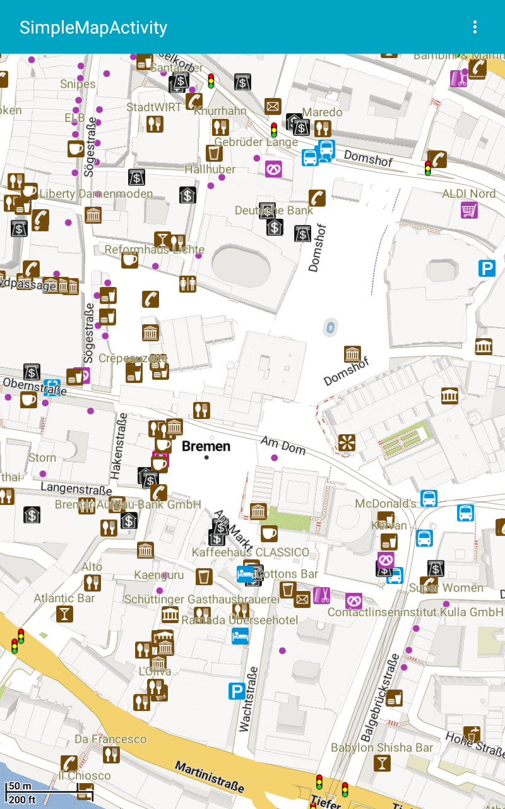
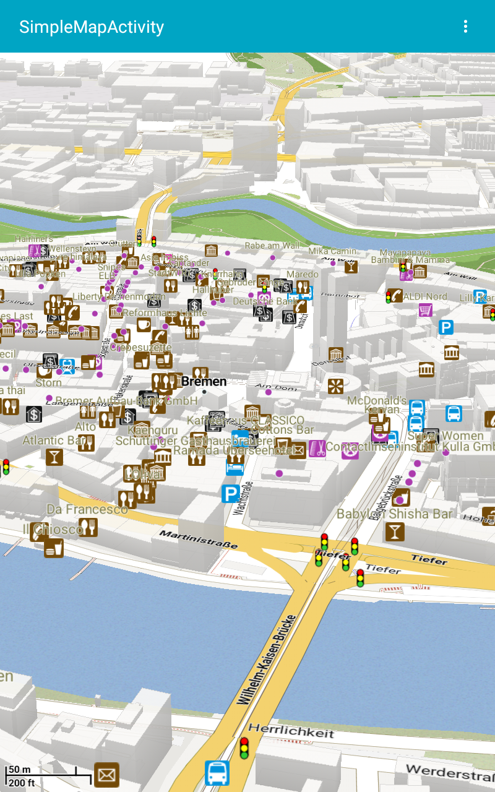

# V™

VTM was developed within the [OpenScienceMap](http://opensciencemap.org) project.

**This fork is for continue VTM development. And make it compatible with latest [Mapsforge](https://github.com/mapsforge/mapsforge).**

See the [integration guide](docs/Integration.md). If you have any questions or problems, don't hesitate to ask our public [mailing list](https://groups.google.com/group/mapsforge-dev) for help. You can also report bugs and improvement requests via our [issue tracker](https://github.com/mapsforge/vtm/issues). And read through [how to contribute](.github/CONTRIBUTING.md) guidelines.

## Features
- Java map library
- OpenGL vector-tile rendering
- Themeable vector layers
- Support for multiple tile sources:
  - primary opensciencemap (.vtm)
  - mapsforge files
  - GeoJSON tiles
  - bitmap: any quadtree-scheme tiles as texture
- Backends:
  - Android (optional libGDX)
  - iOS (using libGDX/RoboVM, [instructions](docs/ios.md))
  - Desktop (using libGDX/JGLFW)
  - HTML5/WebGL (using libGDX/GWT)

### Projects
- **vtm** contains the core library
- **vtm-android** Android backend (no libGDX required)
- **vtm-android-example** provides examples using **vtm-android**
- **vtm-gdx** common libGDX backend
- **vtm-android-gdx** Android backend (with libGDX)
- **vtm-desktop** Desktop backend
- **vtm-ios** iOS backend
- **vtm-web** HTML5/GWT backend
- **vtm-web-app** HTML5/GWT application

The libGDX backend for GWT is experimental.

## Master build downloads
- [Latest jars and samples](http://ci.mapsforge.org/job/vtm/)

## WebGL Demo
[OpenScienceMap](http://opensciencemap.org/s3db/#scale=17,rot=61,tilt=51,lat=53.075,lon=8.807) view of Bremen.
- hold right mouse button to change view direction

## Credits
This library contains code from several projects:
- **mapsforge**: based on 0.2.4 (https://github.com/mapsforge/mapsforge)
- **osmdroid**: some overlay classes (https://github.com/osmdroid/osmdroid)
- **libGDX**: AsyncTask, MathUtils and Interpolation classes (https://github.com/libgdx)
- **Android**: some Matrix code, TimSort (http://source.android.com)
- **tessellate**: (https://github.com/cscheid/tessellate)

## Screenshots

